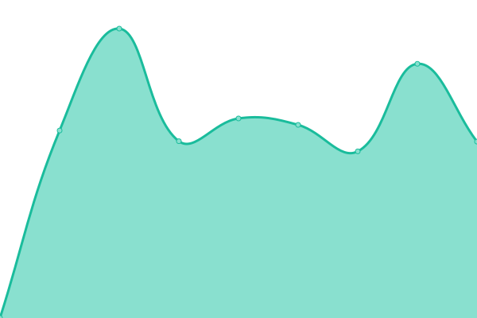

# [📈 Live Status](https://status.anton.royletron.dev): <!--live status--> **🟧 Partial outage**

This repository contains the open-source uptime monitor and status page for [Upptime](https://upptime.js.org), powered by [Upptime](https://github.com/upptime/upptime).

With [Upptime](https://upptime.js.org), you can get your own unlimited and free uptime monitor and status page, powered entirely by a GitHub repository. We use [Issues](https://github.com/upptime/upptime/issues) as incident reports, [Actions](https://github.com/royletron/anton-uptime/actions) as uptime monitors, and [Pages](https://status.anton.royletron.dev) for the status page.

<!--start: status pages-->
<!-- This summary is generated by Upptime (https://github.com/upptime/upptime) -->
<!-- Do not edit this manually, your changes will be overwritten -->
<!-- prettier-ignore -->
| URL | Status | History | Response Time | Uptime |
| --- | ------ | ------- | ------------- | ------ |
|  [Blog](https://blog.anton.royletron.dev) | 🟩 Up | [blog.yml](https://github.com/royletron/anton-uptime/commits/HEAD/history/blog.yml) | 

 1182ms
     
 | 

<a href="https://status.anton.royletron.dev/history/blog">99.26%</a>
    

|  [Comments](https://commento.anton.royletron.dev) | 🟩 Up | [comments.yml](https://github.com/royletron/anton-uptime/commits/HEAD/history/comments.yml) | 

 955ms
     
 | 

<a href="https://status.anton.royletron.dev/history/comments">99.21%</a>
    

|  [Analytics](https://shynet.anton.royletron.dev) | 🟩 Up | [analytics.yml](https://github.com/royletron/anton-uptime/commits/HEAD/history/analytics.yml) | 

 1178ms
     
 | 

<a href="https://status.anton.royletron.dev/history/analytics">99.36%</a>
    

|  [Storage](https://mess-3.anton.royletron.dev/minio/health/live) | 🟩 Up | [storage.yml](https://github.com/royletron/anton-uptime/commits/HEAD/history/storage.yml) | 

 820ms
     
 | 

<a href="https://status.anton.royletron.dev/history/storage">99.53%</a>
    

|  [CI](https://ci.anton.royletron.dev/healthz) | 🟥 Down | [ci.yml](https://github.com/royletron/anton-uptime/commits/HEAD/history/ci.yml) | 

 790ms
     
 | 

<a href="https://status.anton.royletron.dev/history/ci">0.00%</a>
    

<!--end: status pages-->

[**Visit our status website →**](https://status.anton.royletron.dev)

## 📄 License

- Powered by: [Upptime](https://github.com/upptime/upptime)
- Code: [MIT](./LICENSE) © [Upptime](https://upptime.js.org)
- Data in the `./history` directory: [Open Database License](https://opendatacommons.org/licenses/odbl/1-0/)
